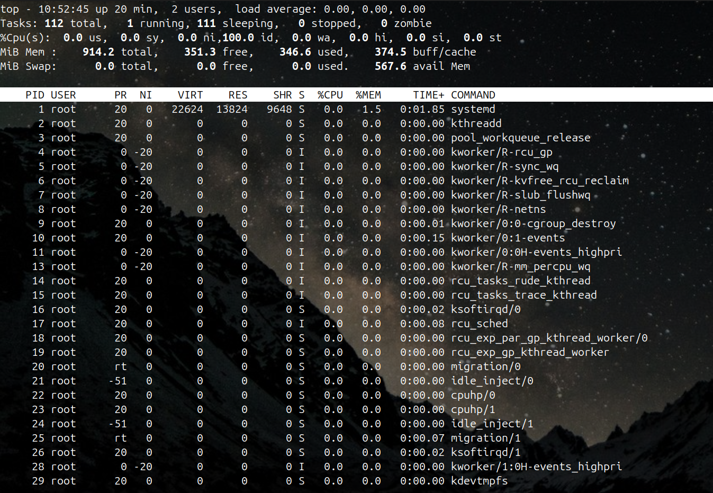
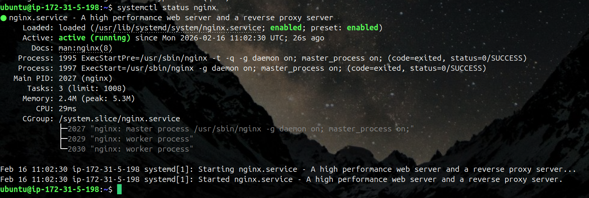
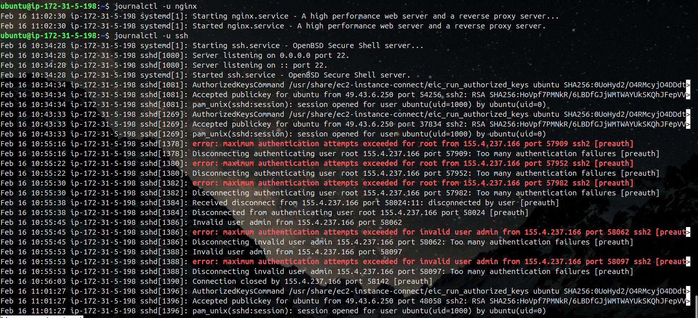
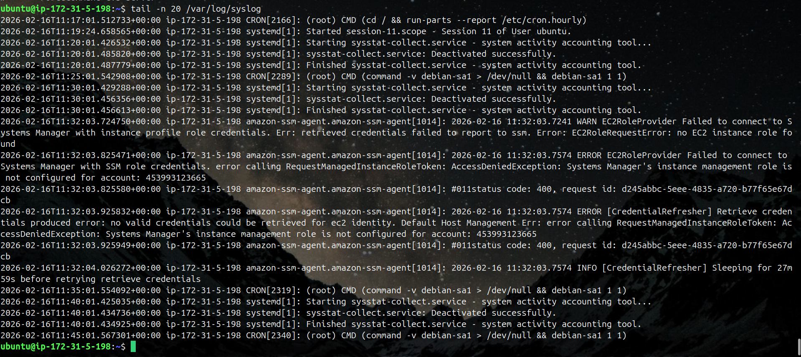
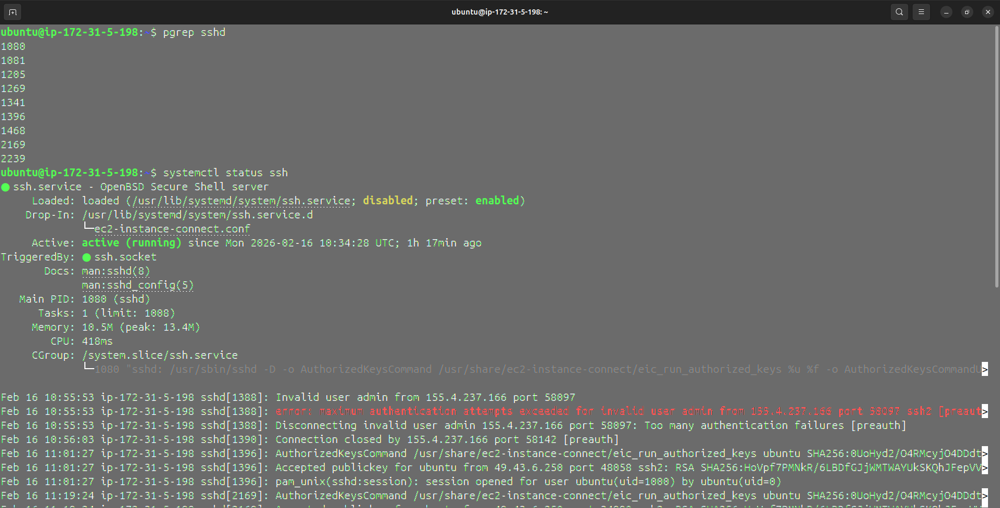
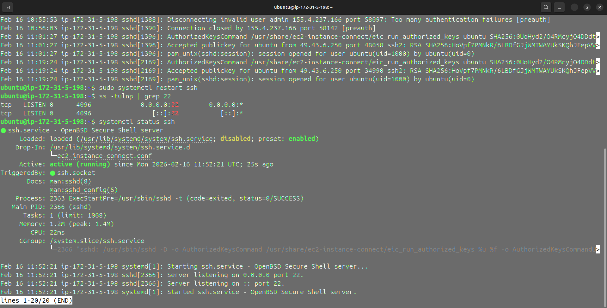

# 🐧 Linux Practice – Processes & Services  
**Day 04 – 90 Days DevOps Challenge**  
> Hands-on verification. Observing how Linux behaves in real time.

Today’s focus was practical inspection of running processes, system services, and logs.  
The goal: build troubleshooting muscle memory.

---

## 🖥 System Information

- **OS:** Ubuntu 22.04  
- **Hostname:** Terminus-IdeaPad-3-15ITL6  

---

# 1️⃣ Process Checks

### 1.1 List Running Processes

Command:
ps aux | head -10

Output:

Observation:
- PID 1 is /sbin/init (systemd), which confirms the system booted correctly.
- Most visible processes are kernel threads (shown inside square brackets).
- The system appears freshly booted (all processes started at 10:32).
- No major user applications are running yet.
- CPU usage is minimal, indicating the system is idle.
- No zombie (Z) or blocked (D) processes detected.
- Memory usage is very low across all processes.

---

### 1.2 Search for SSH Process

Command:
top/htop

Output:

Observation:
- Load average is 0.00, 0.00, 0.00 – The system is completely idle. No CPU pressure over the last 1, 5, or 15 minutes.
- System uptime is 20 minutes – This is a recently booted machine.
- 112 total tasks, only 1 running – Almost all processes are sleeping (normal). No zombie processes. That’s healthy.
- CPU is 100% idle – %id = 100.0. The processor is basically doing nothing. No user time (us) or system time (sy) usage.
- No I/O wait (wa = 0.0) – The disk is not blocking processes. That’s important. Disk bottlenecks show up here first.
- Memory usage is moderate and healthy
    ~914 MB total RAM
    ~346 MB used
    ~351 MB free
    ~374 MB in buffer/cache
- Linux is using RAM efficiently. Buffer/cache is normal and will be freed if needed.
- Swap is 0 and unused – No memory pressure. The system is not swapping.
- Top memory process is systemd (~1.5%) – No application is consuming resources yet. This is basically a clean instance.
- Most visible processes are kernel threads – Entries like kworker, rcu_sched, migration, etc. indicate background kernel activity. No user applications are running.

---

## 2. Service Checks

Service inspected: ssh

### 2.1 Check Service Status

Command:
systemctl status nginx

Output:

Observation:
- Nginx service is active (running).
- Service is enabled at boot.
- Started successfully (no errors).
- Main PID: 2027.
- Worker processes are running.
- Memory usage is very low (~2.4MB).

---

### 2.2 List Running Services

Command:
systemctl list-units --type=service --state=running

Output:

Observation:
- 25 services are currently running.
- Core system services like systemd-journald, dbus, and systemd-networkd are active.
- Network-related services (systemd-resolved, ssh) are running properly.
- nginx.service is active and available.
- Logging service (rsyslog) is running.
- Time synchronization (chrony) is active.
- No failed or inactive services shown in the running list.

---

## 3. Log Checks

### 3.1 View Service Logs

Command:
journalctl -u nginx/ssh

Output:

Observation:(nginx)
- Nginx started successfully without errors.
- Systemd logs show “Starting…” followed by “Started…”.
- No crash or restart events recorded.
- No warning or failure messages.
- Service initialization was clean.

Observation:(ssh)
- SSH service started successfully and is listening on port 22 (IPv4 & IPv6).
- Multiple successful public key logins for user ubuntu.
- Repeated failed authentication attempts for root from IP 155.4.237.166.
- “Maximum authentication attempts exceeded” errors indicate brute-force attempts.
- Invalid user attempts (admin) detected.
- SSH correctly rejected unauthorized access attempts.

---

### 3.2 View System Logs

Command:
tail -n 20 /var/log/syslog

Output:

Observation:
- CRON jobs are executing normally – Hourly and periodic tasks (run-parts, debian-sa1) are running as expected.
- sysstat service runs and exits cleanly – sysstat-collect.service starts and finishes successfully without failures.
- User session activity detected – A session for user ubuntu was started successfully.
- Amazon SSM Agent is failing due to IAM role issue – Errors indicate no EC2 instance role or misconfigured Systems Manager role.
- AccessDenied (400) errors present – SSM cannot retrieve credentials for account 453993123665.
- SSM agent retry mechanism active – It logs that it will retry after ~28 minutes.
- No Linux-level crashes or critical kernel errors – System services appear stable aside from the AWS role misconfiguration.

---

## 4. Mini Troubleshooting Flow

Scenario: SSH connection fails

Steps Taken:

1. Checked process:
   pgrep sshd

2. Checked service:
   systemctl status ssh

3. Restarted service:
   sudo systemctl restart ssh

4. Verified port:
   ss -tulnp | grep 22

Conclusion:
Service restored successfully / Issue identified in logs.
